# GRIDSET Protocol - Architecture Diagrams

## Table of Contents
1. [High-Level System Overview](#1-high-level-system-overview)
2. [Mid-Level Component Architecture](#2-mid-level-component-architecture)
3. [Low-Level Flow Diagrams](#3-low-level-flow-diagrams)
4. [Data Lineage](#4-data-lineage)
5. [Contract Structure](#5-contract-structure)
6. [Sequence Diagrams](#6-sequence-diagrams)

---

## 1. High-Level System Overview

### 1.1 Complete Protocol Architecture

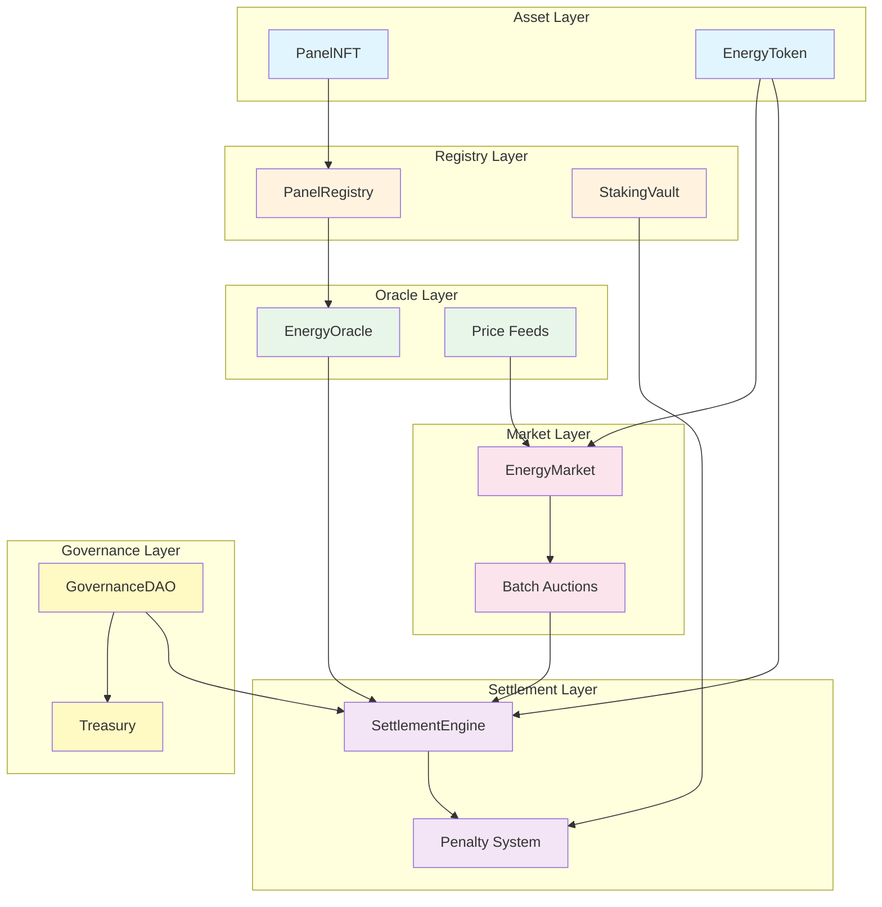

### 1.2 Simplified Protocol Map

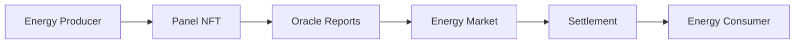

---

## 2. Mid-Level Component Architecture

### 2.1 Smart Contract Hierarchy

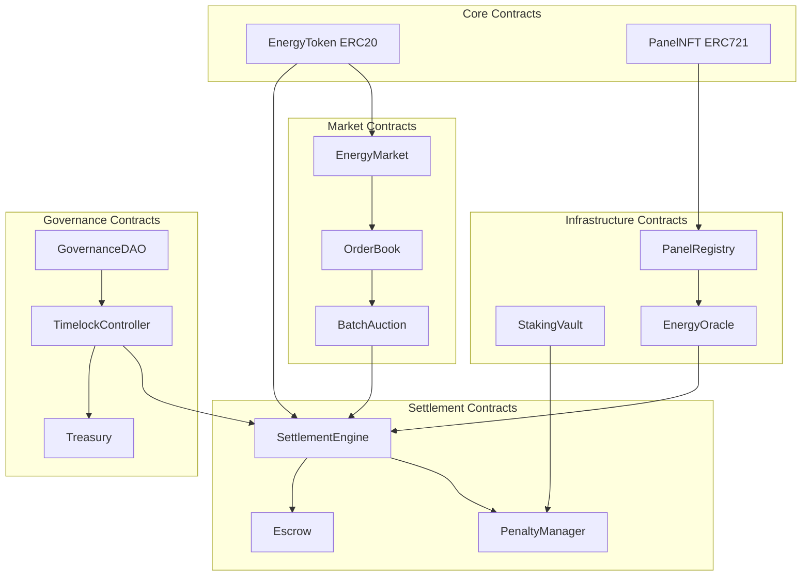

### 2.2 Time Slot System

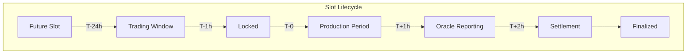

### 2.3 Batch Auction Mechanism

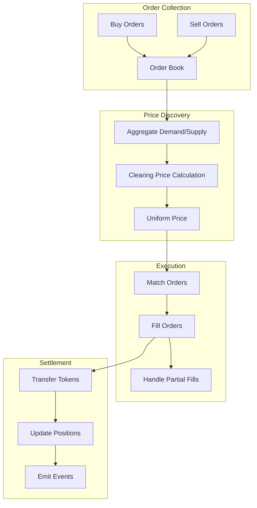

---

## 3. Low-Level Flow Diagrams

### 3.1 Panel Registration Flow

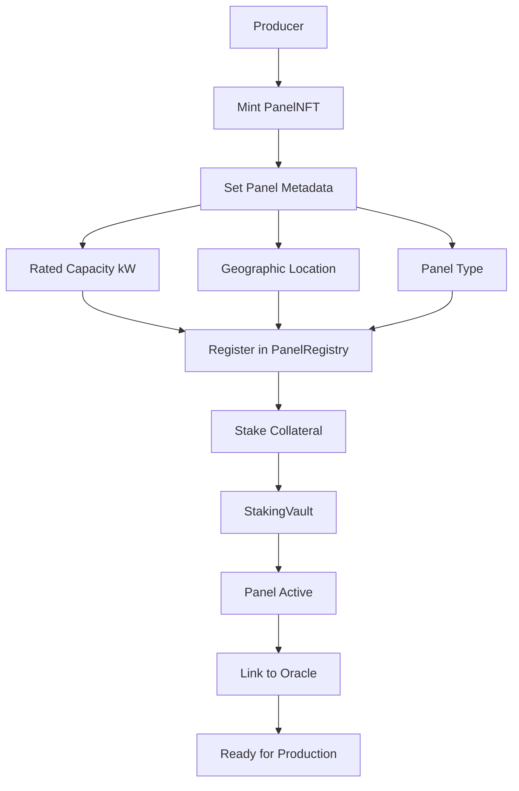

### 3.2 Energy Settlement Flow

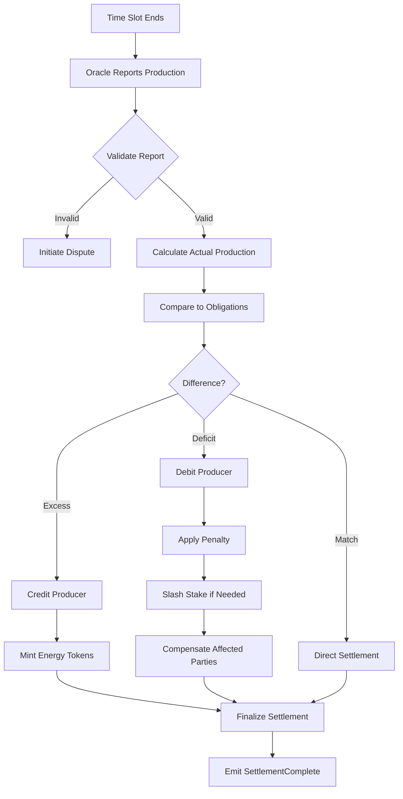

### 3.3 Governance Proposal Flow

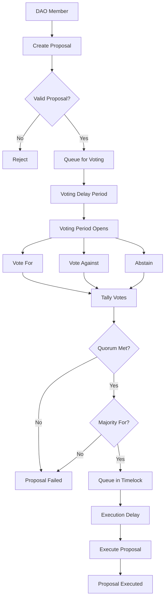

---

## 4. Data Lineage

### 4.1 Energy Production Data Lineage

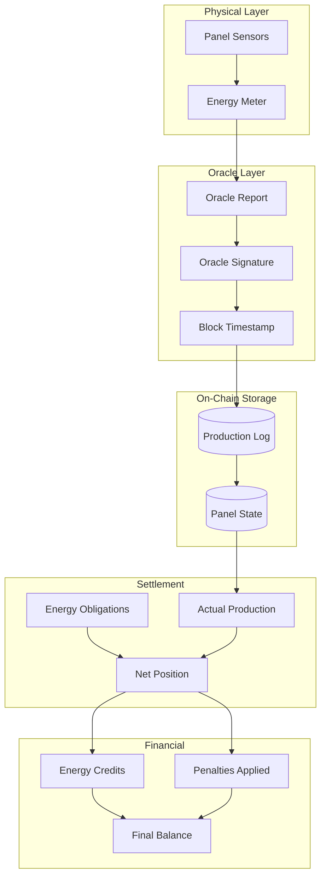

### 4.2 Token Flow Lineage

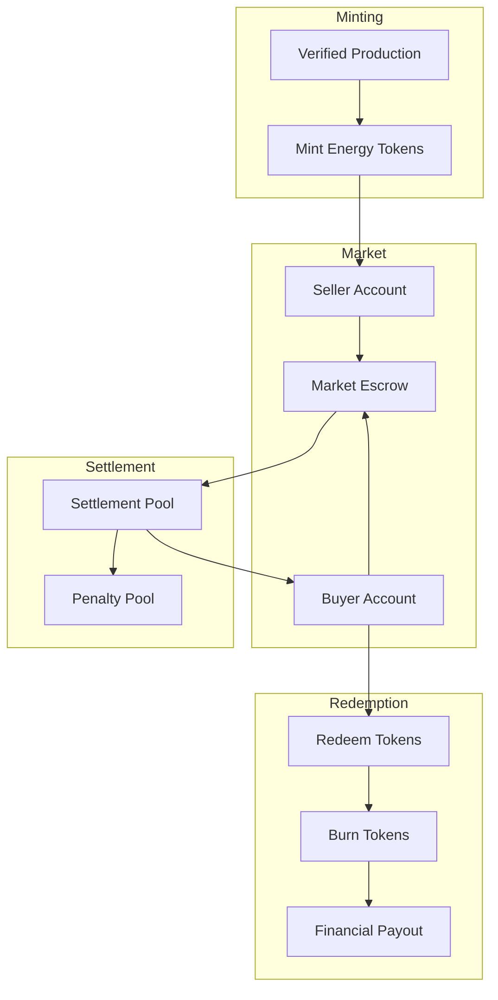

---

## 5. Contract Structure

### 5.1 Core Contract Inheritance

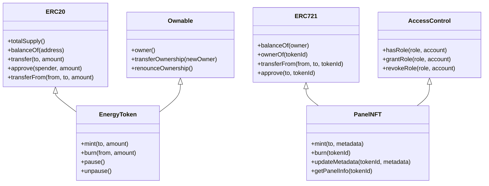

### 5.2 Settlement Contract Structure

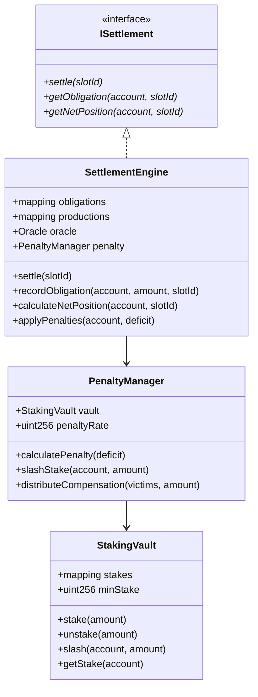

### 5.3 Market Contract Structure

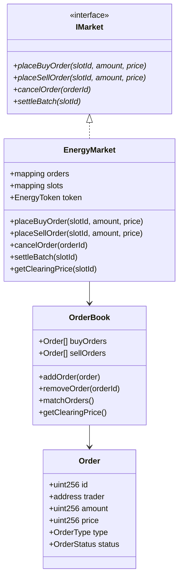

---

## 6. Sequence Diagrams

### 6.1 Panel Registration Sequence

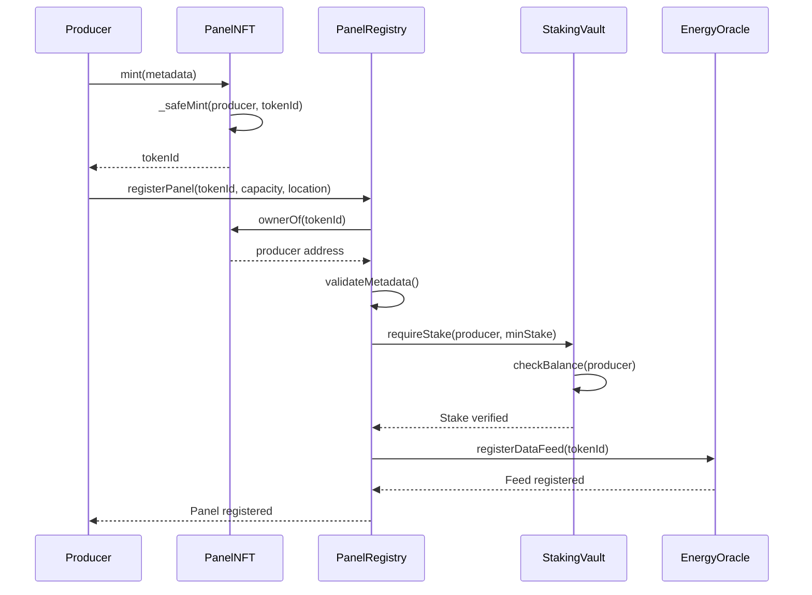

### 6.2 Energy Trading Sequence

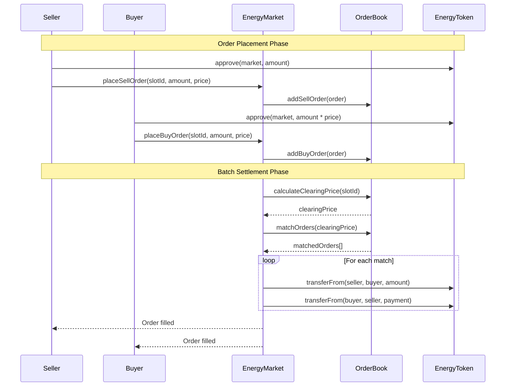

### 6.3 Settlement Sequence

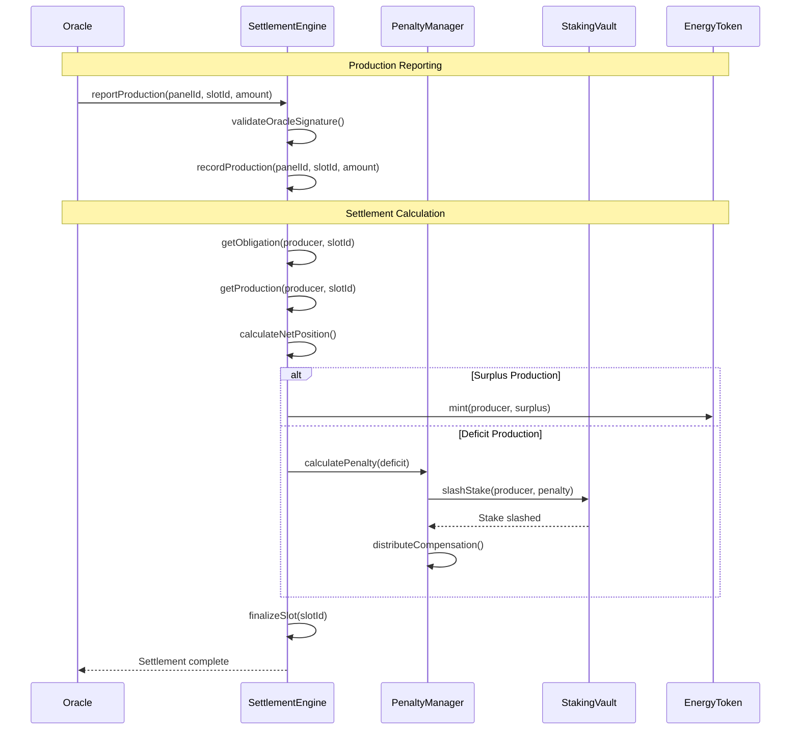

### 6.4 Governance Sequence

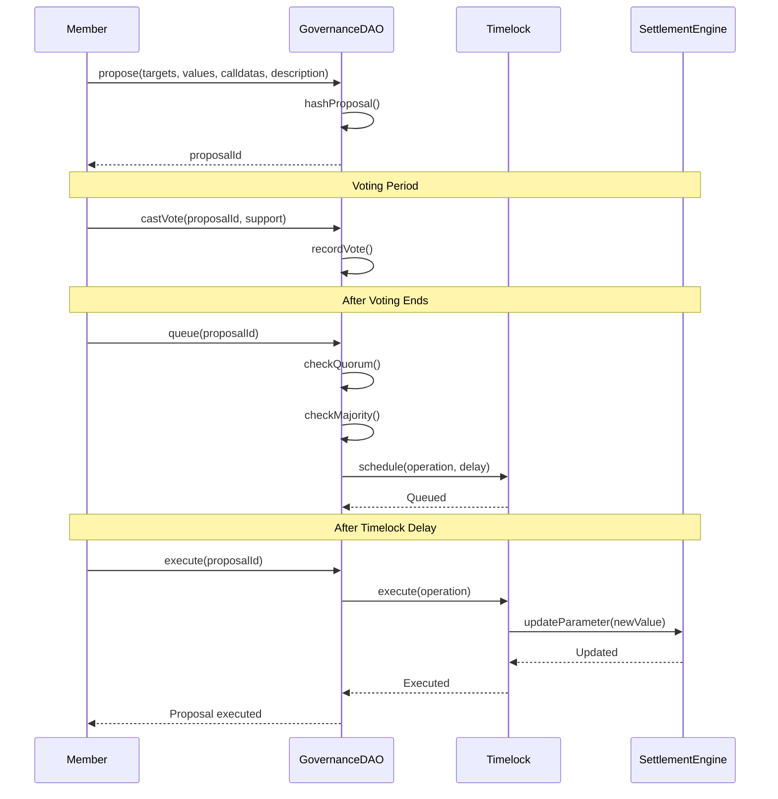

---

## 7. Unified System Map

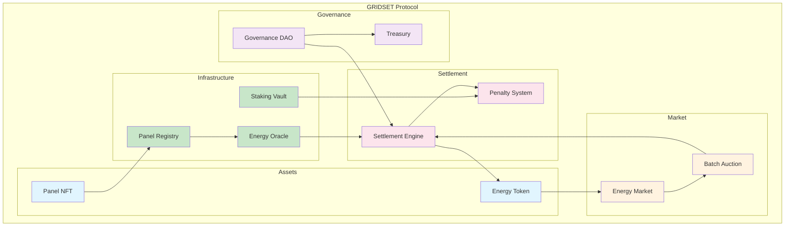

---

## Usage

View these diagrams in:
- GitHub/GitLab markdown preview
- VS Code with Mermaid extension
- [Mermaid Live Editor](https://mermaid.live/)
